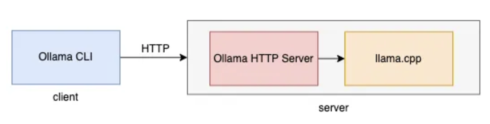
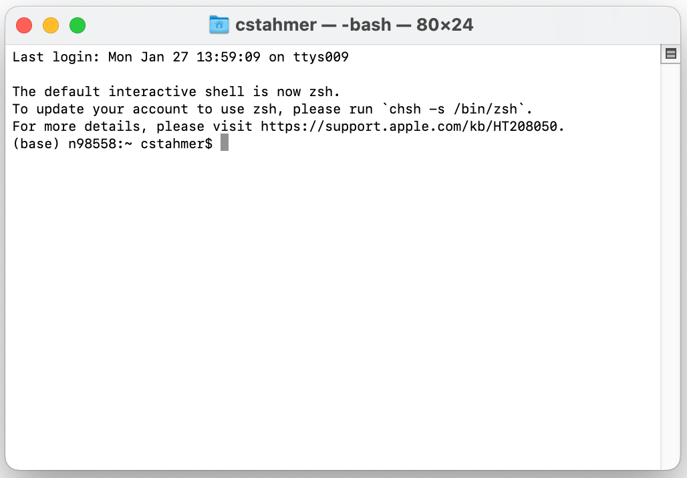

Ollama Architecture
===================

The Ollama Application runs as a background server on your local machine using a classic client server architecture.



Note that the server portion of the architecture contains two components: an underlying C++ application, and a dedicated HTTP server that serves as an API to the Ollama application itself.  

When the Ollama application is launched on your computer, the C++ application initializes and stands ready to receive commands and input. But, the Ollama HTTP Server will not automatically start. The only sign that you, as a user, will be given that it is running is a small llama icon in your task bar.  

Before you can actually use Ollama, you must configure the Ollama C++ application and use it to launch the Ollama HTTP Server to allow you to interact with your chosen model.  This is accomplished via your system's Command Line Interface (CLI):

* Linux:  Launch your chosen shell
* Mac:  Launch Applications -> Utilities -> Terminal application
* Windows: Launch the Windows "Command Prompt" application by clicking on the Windows Explorer icon, searching for "CMD", and opening the "Command Prompt" application. *(Note: if you are on Windows and have taken DataLab's Command Line workshop you should have Git Bash installed, and you can use that instead of the Windows Command Prompt as your CLI if you wish.)*

Depending on your operating system, once you have launched your CLI you will see something like this:



Ollama does not include Unix-style "man" documentation, but the CLI application does include a simple help system.  To access help, enter the following at your command prompt:

```
ollama help
```  

Running the above command will produce the following output:

```
Large language model runner

Usage:
  ollama [flags]
  ollama [command]

Available Commands:
  serve       Start ollama
  create      Create a model from a Modelfile
  show        Show information for a model
  run         Run a model
  stop        Stop a running model
  pull        Pull a model from a registry
  push        Push a model to a registry
  list        List models
  ps          List running models
  cp          Copy a model
  rm          Remove a model
  help        Help about any command

Flags:
  -h, --help      help for ollama
  -v, --version   Show version information

Use "ollama [command] --help" for more information about a command.
```

We'll be learning about many of the available commands as we move through this workshop.


Loading Models
--------------

Ollama allows you to work with a collection of publicly available LLMs.  A complete list of available models can be found [here](https://ollama.com/search).  Individual models must be downloaded to your local system before you are able to work with them.  This is accomplished via the CLI using the "pull" command as follows:

```
pull <model-name>
```

For this workshop, we will be working with the latest version of the Llama model, *llama3.2*.  To pull this model to your local computer, execute the following command in your CLI:

```
pull llama3.2
```

Once the Ollama application has completed downloading and verified the local version of the model, you will be ready to start the Ollama Http Server and begin interacting with the llama model.


Starting the Ollama HTTP Server
-------------------------------

Once you have a model (or models) loaded, you are ready to start the Ollama HTTP Server.  This is performed via the CLI using the run flag.  The generic form of the command is:

```
ollama run <name-of-model>
```

We are going to work the llama3.2 model that we previously downloaded (pulled).  To do so, run the below command in your CLI:

```
ollama run llama3.2
```

Stopping the Ollama HTTP Server
-------------------------------

You can shutdown the Ollama HTTP Server at any time using the following command:

```
/bye
```
