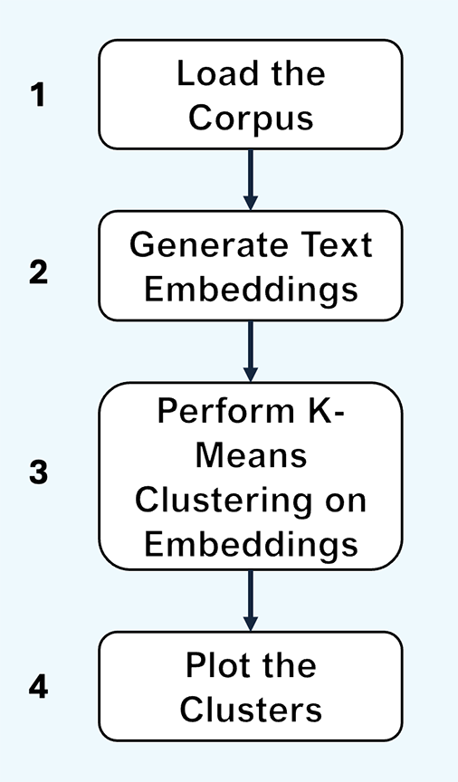

Text Clustering Using Text Vectors
==================================

In this chapter we'll extend our use of the text vector space by performing a clustering exercise based on the vector representation of a collection of open-access medical journals.  A zip file containing the analysis can be found here.

Process Overview
----------------
The text classification workflow duplicates much of the work we performed in our RAG example in the last chapter.  The majore steps in the classification workflow are:




Vector models represent the semantic space of every word in a known vocabulary as large vector of *n* calculated paramenters, where the parametric values assigned to a given word contain weights that are related to the values of the same parameter for every other word.  The datails of the various methods of calculating these weights is beyond te scope of this workshop.  (See the paper referenced in the above paragraph.). The important thing to know in this context is that if you introduce a new word or document into the model, the weights of every parameter for every work will change.  A non-mathematical way to say this is the the parametric definition of each word in the model contains within it the knowledge of every other word in the model. 

The below output shows the vector space for a single word from the Ollama model:

```txt
[0.017877653, 0.06340178, 0.002512074, 0.02502087, 0.014879474, 0.033396315, -0.018965052, 0.021701865, 0.022903813, 0.005726911, 0.011753164, 0.024635881, -0.036029853, -0.0122078825, -0.038973905, 0.028633859, 0.042755026, 0.0041230093, -0.007491054, -0.004649939, -0.04057417, 0.06582168, -0.040506583, 0.047047015, 0.07758565, 0.04061356, 0.08639454, 0.008880966, 0.058461666, 0.020822758, -0.002838804, 0.029212574, 0.09078681, -0.057084266, -0.024549095, -0.016134499, 0.012695589, -0.002101303, -0.009117725, -0.08302931, 0.030918889, 0.004267565, -0.0040433845, 0.003311327, -0.019085197, 0.0013708055, -0.0049502417, -0.0026343798, -0.0055629555, -0.06046351, 0.00037648194, -0.00054742245, -0.028439399, -0.00605915, -0.005068259, -0.051835686, 0.041476496, -0.030044692, -0.009939256, 0.0122636845, 0.036116987, -0.0011576054, 0.017289555, -0.02137621, -0.009717823, 0.018864619, -0.041405194, -0.031779822, 0.016003272, 0.02662322, 0.042489186, 0.05851829, -0.028756421, -0.008845935, -0.022120439, -0.038079057, 0.015947865, -0.010375119, 0.007400938, 0.040579136, 0.042395342, 0.02481092, 0.0069094235, 0.0445682, -0.03433794, -0.006127028, 0.006102693, 0.04437743, -0.005359529, -0.009452275, -0.070931956, 0.024026003, 0.021285562, 0.043804023, -0.0062165977, -0.0031585386, 0.025973827, 0.0022389963, -0.020393115, -0.047750466, -0.016769083, -0.032374572, 0.009353231, 0.05064914, -0.05532496, 0.0037234968, -0.03282322, -0.019148953, 0.020609362, -0.035215434, 0.010370555, -0.01572176, -0.0131997755, -0.018954288, 0.001769391, 0.02663567, -0.052827142, 0.042304583, -0.07665151, -0.0022814118, -0.01620359, 0.004879272, -0.004069177, 0.029104479, -0.04665595, -0.056296546, -0.058358468, 0.06820146, -0.027006276, 0.048776966, -0.0001133284, -0.024395423, 0.0070581045, 0.006074796, -0.016159529, -4.531893e-05, -0.00082628976, 0.0637154, 0.0059138928, -0.03198953, 0.03083209, 0.04447194, -0.010676811, 0.059229825, -0.010191996, -0.0028025664, 0.015581719, 0.0017894701, -0.036908768, 0.032750253, -0.00061538146, -0.00023421139, 0.023999905, 0.05311479, -0.002025976, -0.035598464, 0.05171491, 0.016205553, 0.012384458, 0.015848337, -0.018880742, 0.009939101, -0.04564323, 0.04619895, 0.016052114, 0.029844409, 0.016591715, -0.03304172, 0.010738218, -0.034117375, 0.00042674044, 0.02169864, -0.029808298, 0.047498785, -0.0035721618, 0.0036177752, 0.0024102454, 0.015826527, -0.0043423865, 0.00017197774, -0.013263845, 0.0055757593, -0.021086643, 0.021501157, -0.008960701, -0.013033894, -0.035891533, -0.0023478405, -0.0105842315, -0.029424394, -0.040108405, 0.047428276, 0.032614276, 0.004700818, -0.029580154, 0.013410349, -0.04436798, -0.002524112, -0.043401685, -0.019115387, -0.0310016, 0.042518526, 0.0011768227, -0.009699604, 0.027930323, 0.004868278, 0.042531665, 0.023388566, -0.031542692, -0.022126734, 0.02991803, 0.020402728, 0.01740285, -0.03146585, 0.0006675659, -0.043296386, -0.024070092, 0.05440069, -0.091592595, -0.015312188, 0.021202749, 0.04029528, 0.033521898, 0.0662376, 0.041259386, 0.0019152533, 0.04165173, 0.015476845, -0.027217526, -0.013091816, -0.023338709, 0.046423323, 0.021806458, -0.028718244, 0.027715893, -0.008203636, 0.034483273, -0.013777358, 0.04319412, 0.01159729, 0.037991833, -0.0030139738, -0.012506061, -0.020538852, 0.07347958, 0.021088123, 0.015355857, -0.019658286, -0.0010304014, 0.0010367308, -0.0011895543, 0.03294703, -0.009129162, 0.052312456, 0.02493031, 0.025089836, 0.02234913, 0.010121085, 0.004974439, -0.017856015, -0.04785278, -0.06071542, 0.024878934, 0.022103539, 0.060682718, -0.029474825, -0.030727727, 0.0070011443, 0.012871844, -0.036305573, -0.04627666, -0.042255938, -0.035090264, -0.025596995, -0.0038353072, -0.023908876, 0.034437925, -0.011242904, -0.037104122, -0.017154701, 0.014371906, 0.0004429378, -0.070667475, -0.021502772, 0.003996584, 0.0016655694, -0.0037696788, 0.018496107, -0.0061283647, 0.029722132, -0.030419748, 0.008249602, -0.034229085, -0.034054644, 0.0022367463, 0.006322647, -0.0008654106, -0.013552419, 0.06015992, -0.04670435, -0.017072657, 0.011510181, -0.014638132, -0.01768795, -0.045838796, 0.0074388813, 0.014886965, -0.026288446, -0.017072698, 0.018787256, -0.0076605147, 0.043190476, 0.001253275, 0.040448133, -0.046431907, 0.06465034, -0.0042557577, 0.035780855, -0.007854722, -0.033858318, 0.013364367, 0.0051386314, 0.048734456, 0.028555216, 0.03291735, 0.051106986, -0.04020619, -0.039092552, 0.0004201808, 0.0558873, 0.0020150295, -0.060250822, -0.015357823, -0.014334893, 0.038407065, 0.062022515, -0.010649503, -0.020467315, -0.055101153, 0.031293012, 0.018142227, -0.029579649, 0.06103102, 0.03194345, -0.02866799, 0.016186291, 0.025313077, -0.01804975, 0.022064071, 0.057739165, -0.020422406, 0.015787605, 0.023415362, 0.035081822, 0.03416815, -0.0037626491, -0.010472144, 0.005786563, -0.029405741, 0.020895246, -0.0357163, 0.03586897, 0.01803324, 0.0036253817, 0.023799744, -0.02189161, 0.0013853569, -0.05124004, 0.006333707, -0.028821146, 0.018659985, 0.020827137, 0.022584653, -0.026804551, -0.050562136, 0.004859809, -0.00022457466, -0.060961388, 0.034191944, -0.0520906, 0.012428855, -0.0026420208, -0.013416474, 0.006723866, -0.00907954, -0.050680887, 0.020570999, 0.07329765, -0.021525482, 0.044000793, 0.022455772, -0.054601602, -0.001437439, 0.007880718, -0.027988305, -0.01858485, -0.012942602, 0.033937123, -0.028871242, -0.037330575, 0.0034082544, -0.012213574, 0.027358947, -0.012678767, -0.0012281493, -0.008216995, 0.0098119145, -0.013236902, 0.035422873, -0.05698667, 0.026304422, 0.025371647, -0.0687202, 0.047070544, 0.0033676485, 0.01868831, -0.042346913, -0.047602106, 0.0009473163, 0.0047479523, -0.025525795, -0.06124635, -0.0013746346, 0.012058469, 0.044922817, -0.031448822, 0.019288784, -0.012294686, -0.0029466779, 0.022633798, 0.046065114, -0.032607388, -0.05304123, -0.007924773, 0.03622815, 0.01062153, 0.019646611, 0.0034436306, -0.037126176, -0.018911213, 0.018784648, 0.024862075, 0.042500857, 0.006417808, 0.019235246, -0.013034909, 0.018130388, -0.0013267407, -0.00083176536, -0.00448969, 0.018655175, -0.057097565, -0.030697485, -0.013828505, -0.05019637, 0.0043303664, -0.014013816, -0.0069711655, -0.00027030072, -0.060510688, 0.0023435664, 0.015674897, 0.05176054, -0.014777224, 0.03503745, 0.02785944, 0.029323699, -0.009299999, 0.06398674, 0.046859678, 0.030094558, 0.01259041, 0.036267675, -0.052898552, -0.0006897955, -0.042908654, -0.0008491797, 0.0071274517, 0.04439769, 0.0022068666, -0.033317126, -0.041258458, -0.0012851228, 0.010489072, 0.025735304, -0.011091368, -0.045162655, 0.04294225, -0.007700677, -0.013193355, 0.004827113, 0.03687263, 0.027334342, 0.01824656, 0.018245494, 0.02662087, -0.034855142, -0.0003569712, 0.080406114, 0.0018468174, 0.013922922, -0.018535022, 0.03824286, 0.043014415, 0.03012092, 0.00803271, -0.03232023, -0.036566664, -0.04382392, 0.0040705246, 0.0150932595, -0.0033885865, 0.019958686, -0.034229252, 0.011928538, 0.02391127, 0.04755791, -0.029175205, -0.04682454, 0.02338032, 0.031248016, -0.06120794, -0.039181888, 0.042640693, -0.008935619, -5.115602e-05, 0.025923697, 0.03046568, -0.032538872, -0.07774579, -0.047744945, -0.032523815, 0.013560552, -0.019092428, 0.031365734, -0.0022067484, 0.032985773, 0.01676509, -0.038079567, -0.011245432, -0.018426247, -0.00963427, 0.036454313, -0.04823799, -0.007587352, 0.008115187, 0.048818875, 0.0153698195, 0.0077248164, -0.01555647, 0.04640162, 0.042655896, 0.02184045, -0.034443665, -0.05343133, -0.0039155954, -0.017624898, 0.055692866, 0.021329513, 0.058465578, -0.015564522, 0.02277778, -0.012915606, -0.007953365, -0.0055068564, -0.02201194, -0.025188457, -0.016094543, 0.013643234, 0.031373184, -0.01611006, 0.005265972, 0.040668696, 0.012431018, 0.047379185, -0.010484066, -0.080858625, -0.010537491, -0.02135213, 0.060060862, -0.028551204, 0.01085753, -0.0044772346, 0.011353918, 0.069825746, 0.0012897643, 0.045575302, 0.050233044, -0.04639454, -0.043274533, -0.0088698305, -0.009285012, 0.029509, -0.057046, 0.019981181, 0.030096136, -0.06739518, -0.04110572, -0.00971853, -0.0312545, -0.051547002, 0.048084266, 0.012502023, -0.010466205, -0.004660218, 0.011354275, -0.044684965, -0.027086467, 0.023491893, 0.042202327, -0.042279933, 0.06430072, 0.0076309554, -0.043298926, 0.025694486, -0.033425454, -0.022714725, -0.037531648, 0.05346618, -0.02026543, -0.048849754, -0.007577428, 0.026761733, 0.017290449, -0.057991516, -0.016920853, -0.027190786, -0.00909436, 0.032961052, 0.017874414, -0.06763719, 0.0006165022, 0.0087364875, 0.0142304795, 0.030081693, -0.0038981324, 0.011335561, -0.0009760232, -0.062857576, -0.0141597055, 0.051928427, -0.0019329971, -0.005905841, -0.027917175, 0.024023794, -0.029292746, -0.03817091, 0.0005423172, -0.011840818, 0.044430126, 0.016287055, 0.03094146, -0.026098186, 0.0069974707, -0.048900567, 0.026985843, 0.022422804, -0.019137315, -0.037108816, 0.038627103, 0.038475305, 0.017588839, -0.04594434, -0.022467958, 0.026242614, -0.003626525, -0.005459161, 0.005077498, -0.054963883, -0.038264934, -0.032436837, -0.042729624, 0.013707538, 0.020233767, 0.038336527, -0.015694082, 0.013093894, 0.0052572903, 0.023632064, -0.08146409, 0.050827812, -0.019896386, 0.010401246, -0.06778004, 0.021781597, 0.04689888, -0.04319867, 0.016965883, 0.022130005, 0.023766624, -0.013749355, -0.0060635735, 0.06975141, 0.018952014, 0.0069972123, 0.00504026, -0.023830919, -0.037890524, -0.016333593, -0.0120985545, 0.038249396, 0.02512755, -0.033442978, 0.025615495, 0.06467917, 0.018649945, -0.0045876806, -0.029679516, 0.007530205, -0.0055214935, 0.020197572, -0.024790697, 0.03483397, -0.024737723, -0.018295601, -0.042120326, 0.01887309, -0.009808555, -0.023777742, -0.061494462, 0.01789982, 0.02538138, -0.008253647, -0.035184555, 0.03329778, 0.01434242, -0.010552813, 0.03156485, -0.012651758, 0.015550292, -0.012159424, -0.008866914, 0.03016665, 0.00047264615, 0.002137789, 0.03800385, 0.013032143, 0.038531527, -0.023826802, -0.026870178, 0.008296305, 0.011327403, 0.011354583, 0.008343737, -0.03011617, -0.01695832, -0.030502837, -0.056637384, 0.007969275, 0.005983118, -0.014082555, 0.008388151, 0.0041729757, -0.002980083, -0.02793856, -0.0040570614, -0.03271183, -0.014064461, -0.0038818293, -0.021579802, -0.011951472, -0.009213087, -0.04639352, -0.019941697, -0.00862354, -0.040463027, 0.0027768584, 0.036274806, -0.006100972, -0.019409427, 0.019028286, 0.020864759, 0.023779923, -0.043357033, 0.014085626, -0.029877884, 0.0026885546, -0.020892423, -0.0138810035, 1.2074211e-05, -0.010356221, -0.047326554, 0.0014202517, 0.041650508, 0.008155009, -0.01450383, 0.014305613, 0.06366619, -0.02081839, -0.00822323, 0.048510242, -0.0037666806, 0.023664556, 0.0045068995, -0.032586563, 0.021237116, -0.02607813, 0.042608, -0.023525318, 0.021150945, -0.0029519917, -0.008412834, -0.0152705945, 0.022217998, 0.0040978184, -0.028645568, -0.011396287, -0.04190508, -0.0040457537, 0.0373357, -0.025256395, -0.066077806, 0.00964128, -0.04682747, -0.03272878, 0.027395088, 0.024279382, -0.005157404, -0.018477073, -0.07227116, 0.0078007714, 0.033792075, 0.0087622525, 0.024143495, -0.017744526, 0.06872509, 0.029899307, 0.015984805, -0.0032637268, -0.020403294, -0.01518212, -0.03185177, -0.03993953, -0.0066711167, 0.017834764, -0.013637137, -0.034408275, 0.00044049698, 0.03190554, -0.0017063806, -0.05234689, 0.010903661, 0.013306636, -0.057937864, -0.004879621, -0.022680474, -0.057177156, 0.012787167, -0.0035027317, -0.012204662, -0.043406643, 0.0021993837, 0.029110951, 0.071350016, -0.018334549, 0.005950288, -0.042299487, 0.011649722, -0.05013199, 0.012960693, -0.0038134519, -0.015828637, -0.0036978805, -0.014976756, -0.027449084, -0.051304407, 0.03896375, -0.026833659, -0.04779689, 0.008757001, 0.022397019, -0.022991782, -0.019497303, 0.0035975624, 0.017831575, -0.016879983, 0.005123394, 0.04163835, 0.0020756787, -0.009649309, 0.022750607, -0.036457054, -0.02670016, 0.042065192, 0.019326141, 0.06558085, -0.022085935, 0.0010581234, 0.019861665, -0.011214135, -0.028121853, 0.011319331, 0.0050522136, -0.03485415, 0.030448683, 0.0029888002, -0.01445645, -0.014735276, -0.01375081, -0.048828777, 0.03580206, 0.027761148, -0.05064619, -0.011247271, 0.04609971, -0.003069608, -0.05282368, -0.034661315, 0.033407543, -0.025460843, 0.008799487, 0.0091642765, -0.008024074, -0.0047479337, -0.016529204, 0.024267333, 0.035559356, 0.07985593, -0.05046684, -0.06790705, -0.0071336497, 0.011956307, 0.009010545, -0.022069622, 0.04654688, -0.004984532, -0.05698449, 0.02789896, -0.006470848, 0.16390756, 0.008620992, 0.0386373, 0.004040578, -0.012715728, 0.0032905366, 0.03312697, -0.0031326956, 0.033616826, 0.0037641323, -0.011224089, -0.0056482824, 0.045344375, 0.034810774, 0.011302915, 0.031056117, -0.020407017, 0.021102114, -0.012683138, -0.03400104, -0.015533739, 0.03215273, 0.014327467, -0.029942159, -0.017634615, 0.044326916, 0.014144142, -0.0061987154, 0.021549068, 0.0029852581, 0.042642772, 0.012904342, 0.013874272, -0.023662219, -0.017450072, 0.024523398, -0.013644247, -0.049777966, 0.029591223, 0.0073114377, 0.007386899, 0.02843572, -0.017737953, -0.034420118, -0.057508748, 0.056002054, -0.049297955, -0.01018815, 0.014461512, -0.008235714, -0.022464707, -0.039012287, -0.009419257, -0.05011966, -0.06671197, 0.03013893, 0.0028313391, -0.0165345, -0.06355927, 0.022126166, -0.0014949412, 0.038758017, -0.02068345, 0.028776323, -0.041437782, 0.018729644, 0.037065763, -0.017174859, -0.010060867, -0.037954986, -0.015225971, -0.017563468, -0.04180092, -0.040190753, 0.009099932, 0.007841908, 0.010079515, -0.0028929978, 0.014422519, 0.041526373, -0.025540803, -0.04385223, -0.0336605, 0.016504893, 0.008888867, -0.025477355, -0.0071784807, 0.01078627, 0.026098343, 0.028917082, 0.055467572, -0.027621781, 0.015327966, 0.03297872, 0.027355123]
```

Given the relativistic nature of word vectors, if mapped to a Cartesian plane of *n* dimensions, the vectors of words that share similar meanaings will be closer to each other than the vectors of words that are semantically dissimilar.

INSERT IMAGE

Given this mathematical reality, we can calculate how similar any two words are by calculating the cosign similarity of two word vectors.  The more similar the two vectors are, the more semantically similar the two words are.

We can extend this vecotor space concept to deal with with entire texts by averaging all of the word vectors for each text into tex-vector representations of each text and then calculating the similarity of the text-vectors using same cosign similarity measure.  The more similar the cosign similarities of the two text-vectors are, the more semantically similar the two texts are.

This process could be extended yet agin to classify and compare entire corpora.

Environment Setup
-------------------

To work directly with the word vectors you must dowload the Ollama vector model as a seperate model.  To do so, run the following command from your CLI.

```bash
ollama pull mxbai-embed-large
```

  
Retrieval-Augmented Generation (RAG)
-------------------------------------
RAGs are a popular way of working directly with LLM models to leverage their power to direct people towards libraries of existing texts that relate to their specific prompts/queries.  For example, Help Desk chatbots frequently use RAGS to deliver specific help documentation to users based on their prompts rather than simply generating a response directly from the LLM. Using a RAG framework, for example, one could create a chatbot that receives medical queries and uses RAG to find relevant, peer-reviewed journal papers and returns a relevant list of those articles to the user instead of an AI generated summary of everyting ever said about the query.

Here we will build a simple RAG application based on Ollama.  For this example, we are providing the the training library and user prompt programmatically, but the code could be easily modified to use a training corpus that is stored on disk and to receive the prompt programmatically.  

Our first step is to load the libraries that we will need for our RAG into our Python environment.

```python
import ollama
import numpy as np
from numpy.linalg import norm
```

Now that our environment is ready, let's define the corpus of texts that are available for retrieval and delivery based on our prompt.

```python
documents = [
  "Llamas are members of the camelid family meaning they're pretty closely related to vicuñas and camels",
  "Llamas were first domesticated and used as pack animals 4,000 to 5,000 years ago in the Peruvian highlands",
  "Llamas can grow as much as 6 feet tall though the average llama between 5 feet 6 inches and 5 feet 9 inches tall",
  "Llamas weigh between 280 and 450 pounds and can carry 25 to 30 percent of their body weight",
  "Llamas are vegetarians and have very efficient digestive systems",
  "Llamas live to be about 20 years old, though some only live for 15 years and others live to be 30 years old",
]
```

We'll also here provide our hard-coded user prompt.  As noted eariler, in a real-world application this would be dynamically recieved, as we did in our Chatbot exercise earlier.

```python
prompt = "What animals are llamas related to?"
```

Next we need to gather the embedding vectors for each of the training texts in our *documents* collection.

```python
# create an empty list to hold the returned embeddings for each document
embed_list = []

# store each document embedded space in a list
for d in documents:
  response = ollama.embed(model="mxbai-embed-large", input=d)
  embeddings = response["embeddings"][0]
  embed_list.append(embeddings)
```

The *embed_list* object now holds a collection of document vectors, one each for each of the texts in our training corpus.

At this point, we are ready to process a user query to our RAG.  We've already defined our text query in a *prompt* variable.  Our first action is to generate a vector that represents the enbedded space our prompt.

```python
# get the imbedded space for the prompt
response = ollama.embed(
  model="mxbai-embed-large",
  input=prompt
)

# get just the embeddings vector from the response
prompt_vector = response["embeddings"][0]
```

Our *prompt_vector* variable now contains the vector representation of our prompt. With this in hand, we can now compare the prompt_vector to each of the training texts vectors using a cosign siumilarity measure.  The most similar vector represents the text from our document set that most closely semantically matches our prompt.

```python
# set some base values
max_similarity = -1
most_similar = -1

# loop through our training data and calculate vector similarity to target
for n in range(len(embed_list)):
   # calculate cosign somilarity between prompt vector and training vector
   cosine_similarity = np.dot(embed_list[n], prompt_vector) / (norm(embed_list[n]) * norm(prompt_vector))
   # check if this is more or less similar than last vector and update return values accordingly
   if cosine_similarity > max_similarity:
        max_similarity = cosine_similarity
        most_similar = n
```

Now that we've identified the most similar text in our document library, we return that document to the user as the answer to their prompt.

```python
if most_similar > -1:
   print(documents[most_similar])
else:
   print("Nothing similar")
```

Putting it all together - the complete RAG
------------------------------------------

The code below presents the complete code for our simple RAG workflow.  Inline comments explain each step of the RAG process.

```python
import ollama
import numpy as np
from numpy.linalg import norm

# define a set of training documments.  [These would normally be loaded from a collection
# of files on the computer]
documents = [
  "Llamas are members of the camelid family meaning they're pretty closely related to vicuñas and camels",
  "Llamas were first domesticated and used as pack animals 4,000 to 5,000 years ago in the Peruvian highlands",
  "Llamas can grow as much as 6 feet tall though the average llama between 5 feet 6 inches and 5 feet 9 inches tall",
  "Llamas weigh between 280 and 450 pounds and can carry 25 to 30 percent of their body weight",
  "Llamas are vegetarians and have very efficient digestive systems",
  "Llamas live to be about 20 years old, though some only live for 15 years and others live to be 30 years old",
]

# set a user prompt (normally we'd do this through a user input)
prompt = "What animals are llamas related to?"

# create an empty list to hold the returned embeddings for each document
embed_list = []

# store each document embedded space in a list
for d in documents:
  response = ollama.embed(model="mxbai-embed-large", input=d)
  embeddings = response["embeddings"][0]
  embed_list.append(embeddings)

# embed_list now contains a list of document vectors for the augmenting documents

# get the imbedded space for the prompt
response = ollama.embed(
  model="mxbai-embed-large",
  input=prompt
)

# get just the embeddings vector from the response
prompt_vector = response["embeddings"][0]

# set some base values
max_similarity = -1
most_similar = -1

# loop through our training data and calculate vector similarity to target
for n in range(len(embed_list)):
   # calculate cosign somilarity between prompt vector and training vector
   cosine_similarity = np.dot(embed_list[n], prompt_vector) / (norm(embed_list[n]) * norm(prompt_vector))
   # check if this is more or less similar than last vector and update return values accordingly
   if cosine_similarity > max_similarity:
        max_similarity = cosine_similarity
        most_similar = n

# return the most similar document fromt the training set
if most_similar > -1:
   print(documents[most_similar])
else:
   print("Nothing similar")
```
